
<h1 align="center">武汉君耐营销策划有限公司员工信息管理系统</h1>

## 简介
武汉君耐营销策划有限公司员工信息管理系统：角色分为管理员和员工；功能包括职位管理、公告管理、员工信息管理、考勤管理、请假管理及薪资管理，提供便捷的员工信息录入、查询和管理解决方案。    --计算机毕业设计源码；毕设源码；java毕业设计源码

## 联系方式

<h3 align="center">获取完整代码与数据库文件 + 微信：deepguan QQ: 86050149 QQ群: 783742310</h3>

<h3 align="center">可帮忙远程部署 包运行成功！提供远程部署、修改代码、设计文档指导、代码讲解等服务！</h3>

## 功能介绍（完整见运行截图）
管理员：  登录界面提供了用户名密码输入与角色选择，通过选择“管理员”角色来进入系统。管理员可以访问并管理多个模块，包括员工信息录入、职位管理、公告管理、员工考勤和工资管理等。管理员具备添加、修改和删除员工、公告、职位等信息的权限，还可以批量导入导出数据以便于统计。系统提供筛选和搜索功能，帮助管理员高效查询、调整员工信息和考勤记录。为确保数据安全，系统设置了权限管理功能，管理员可以重置密码和调整账户状态。

员工：  登录进入系统后，员工可使用个人中心查看和修改个人信息。员工模块允许查询各自的考勤信息、请假记录及薪资明细。利用信息输入界面，员工能够填写考勤数据，申请请假，并查看公告与公司通知。薪资管理模块中，员工可以查询个人工资情况，通过输入查询条件快速获得自己的薪资详情。此外，员工可以访问系统提供的考勤数据筛选与备注功能以确保信息准确性。通过友好的界面，员工能快速进行所需的自助服务。

## 运行截图
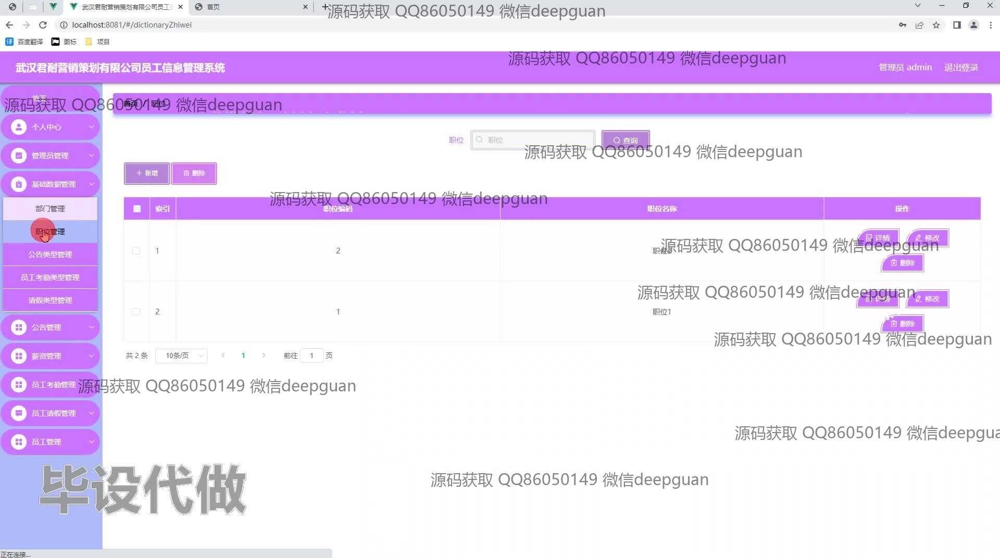
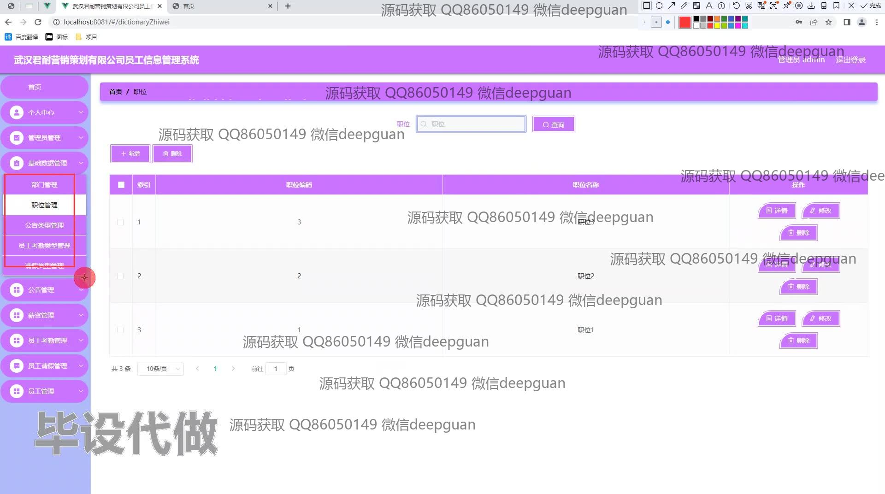
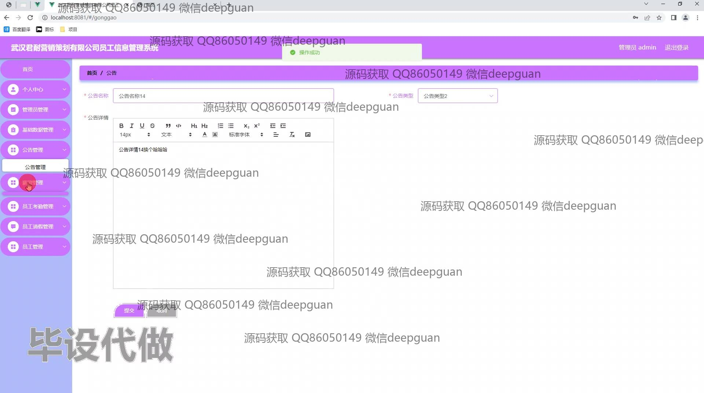
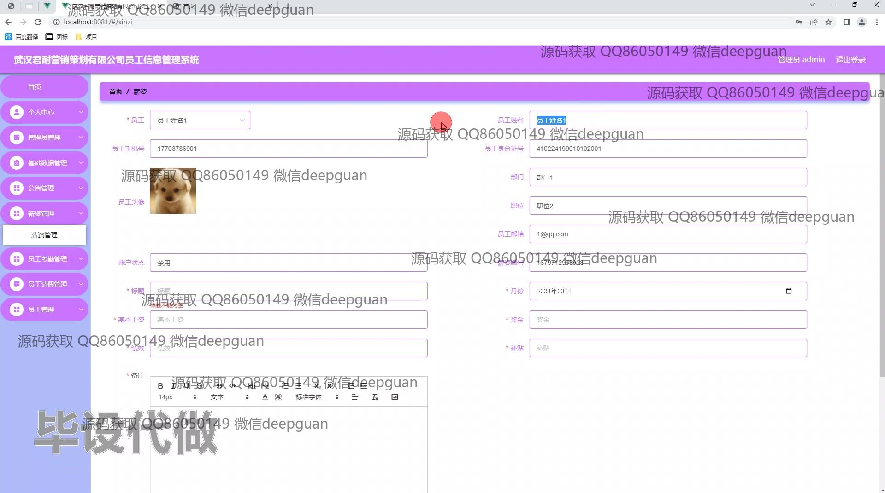
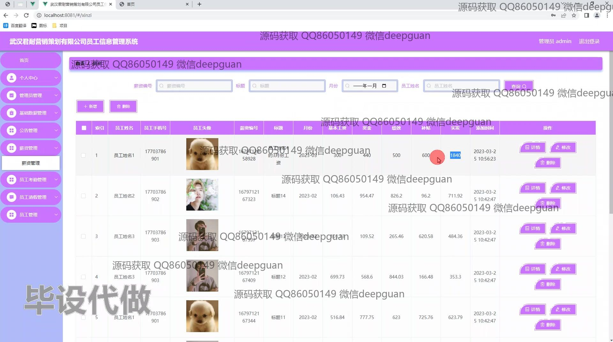
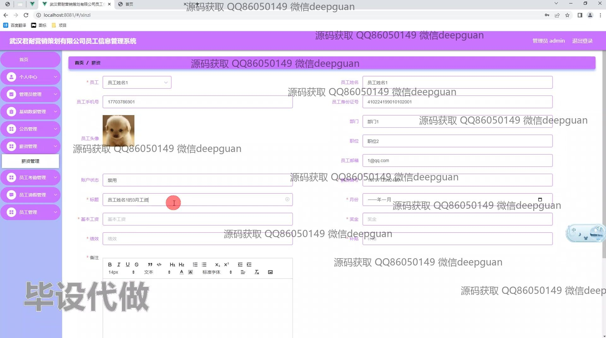
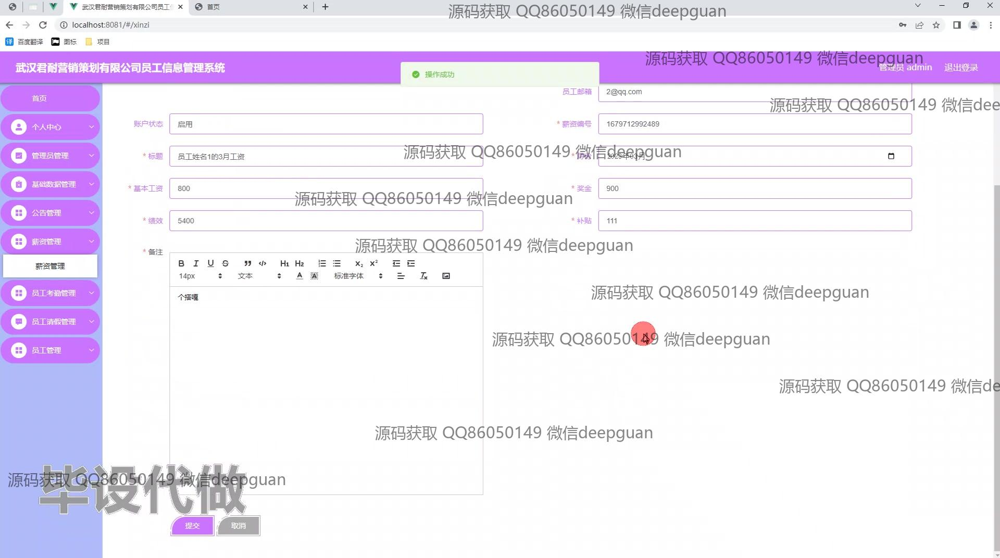
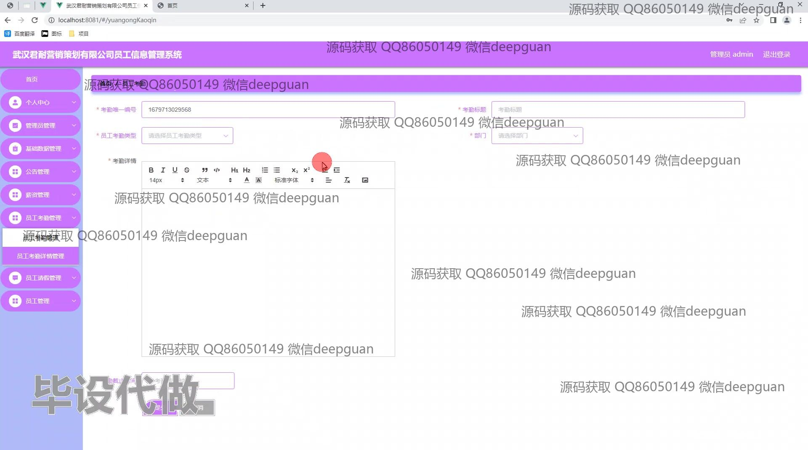
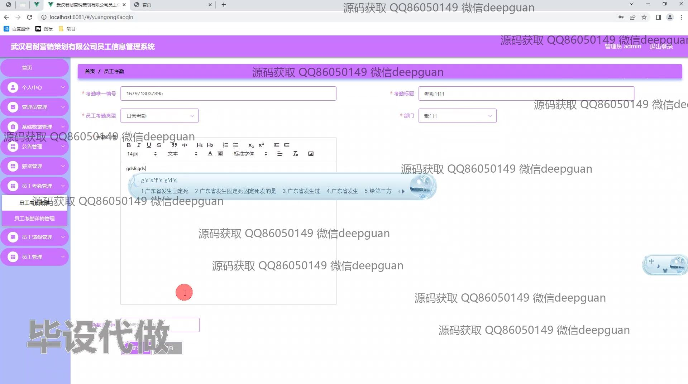
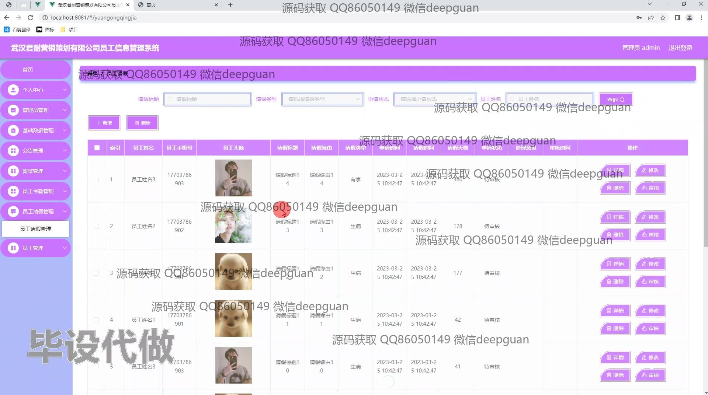
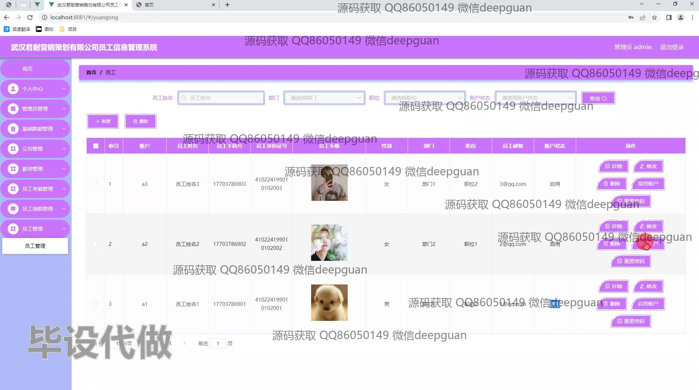
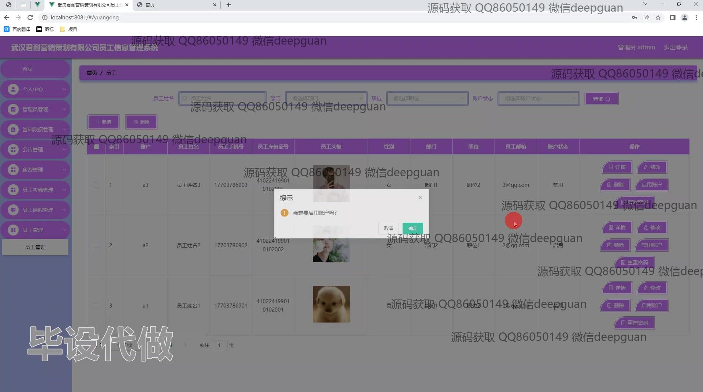
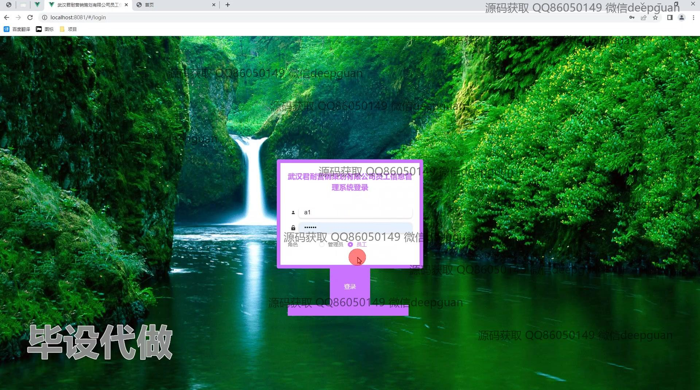
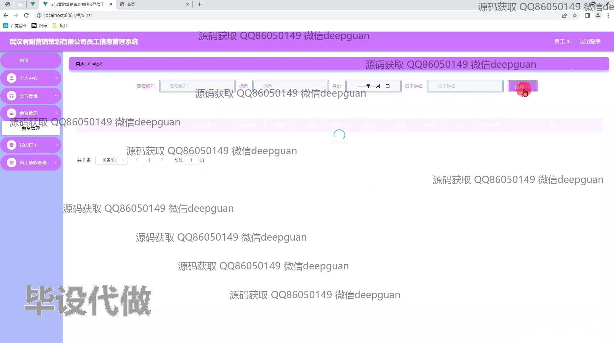

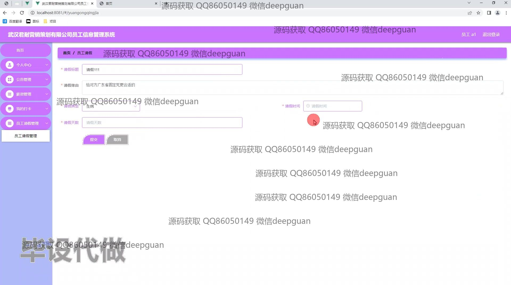
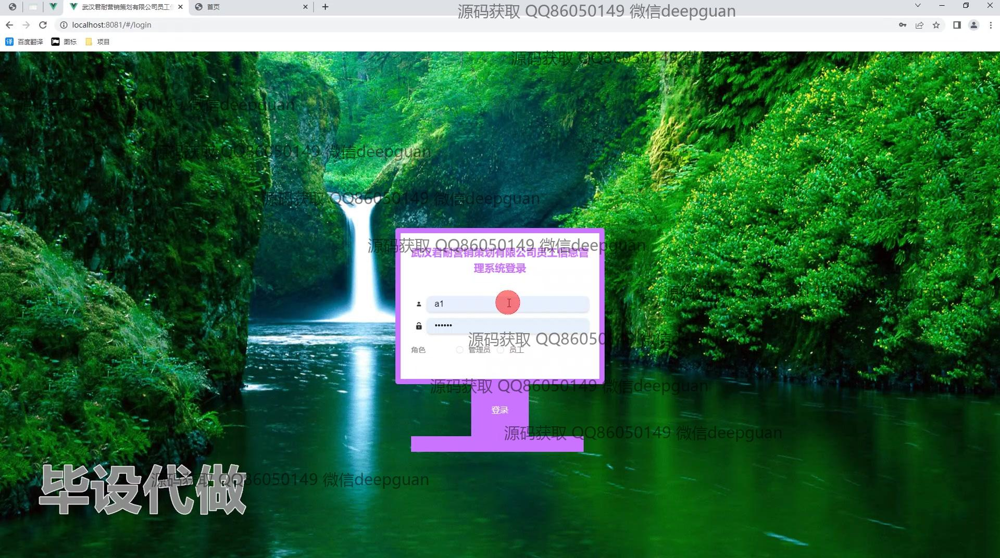

本代码来源于网络,仅供学习参考使用!

